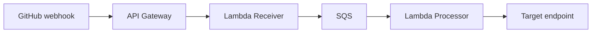

# AWS API Gateway Forwarder

This Terraform code will deploy an API Gateway to receive GitHub webhooks and forward them to a target API endpoint.  It is designed with the following architecture:

GitHub webhook -> API Gateway -> Lambda Receiver -> SQS -> Lambda Processor -> Target endpoint (in this case Jenkins, but could be any endpoint)



## Prerequisites

1. AWS account and configured AWS CLI
2. Terraform installed (version 0.12+)
3. EC2 key pair created in the target AWS region
4. Existing VPC, subnets, and Jenkins host in the target region
   1. Follow the instructions in the aws-jenkins-in-vpc README to create a VPC with a private and public subnet, a NAT gateway for internet access, a bastion host in the public subnet, and a Jenkins host in the private subnet.
5. Sample repo to deploy.  Look at sample-python-app for an example.  I recommend creating this in a new public repository for easier Jenkins testing (no auth needed to access the repo).
6. If you don't have one already, create a webhook secret.  Example with openssl below:

   ```bash
   openssl rand -hex 32
   ```  

## Usage

1. Clone this repository
2. Navigate to the project directory
3. Initialize Terraform:

   ```bash
   terraform init
   ```

4. Review and modify the `variables.tf` file if needed
5. Create a `terraform.tfvars` file with your specific values (Include your VPC details for delivery to a private Jenkins host):

   ```bash
   region = "us-east-1"
   github_webhook_secret = "your-github-webhook-secret"
   target_api_endpoint = "http://<jenkins-private-ip>:8080/github-webhook/"
   process_in_vpc = true  # Set to true if you want to process in VPC
   vpc_id = ""  # Required if process_in_vpc is true.  This will be output from the aws-jenkins-in-vpc deployment
   ```

6. Plan the deployment and apply the changes:

   ```bash
   terraform plan
   terraform apply
   ```

7. Once deployed, create a GitHub webhook at the repository, organization, or enterprise level (Org steps below)
   1. Go to your organization (or repository) and go to settings.
   2. Click on Webhooks
   3. Click "Add webhook"
   4. Set Payload URL to the API Gateway endpoint (output from terraform `api_gateway_url`)
   5. Set Content type to application/json
   6. Set Secret to the GitHub webhook secret (output from terraform `github_webhook_secret_parameter_name`)
   7. Choose which events you want to trigger the webhook (In the Jenkins case, Push and Pull Request events)
   8. Ensure the "Active" box is checked
   9. Add webhook

Once setup we want to verify.  Go into Jenkins, select your pipeline, and click Configuration to modify the config.  Check the box that says "GitHub hook trigger for GITScm polling".  This allows Jenkins to be triggered by the webhook.  Click Save.

Now go to the repository, make a change (like updating the README to trigger a build) and verify it triggers the pipeline.  Note if you change the hello world text in app.py that you also update the test to match.

## Monitoring or Troubleshooting

So your pipeline didn't trigger?  How do we debug this?

1. Check in GitHub where you created the webhook.  When created it will say it never had a delivery.  Now you should see a success or failure.  
2. API Gateway doesn't show much in it's console.  Go to cloudwatch and see the alarms for the API Gateway or the Lambda that is receiving the webhook.  For example, a 502 on the API Gateway is an error in the Lambda that is receiving the webhook.  This is where you want to start most of the time.
3. Go to the Lambda console, go to your github_webhook_receiver function and click the 'Monitor' tab.  See if there are any failures.
4. Click on the 'CloudWatch Logs' link and see if there are any failures in the logs.  Note you can also go directly to this in the CloudWatch console.  The log group is `/aws/lambda/github_webhook_receiver`.  Generally the logs will show if it is receiving the webhook and if there are any errors in the lambda function.
5. Go to the SQS console, see if the message is being received by the queue.  The queue is named `github_webhook_receiver_queue`.  Click on the queue and then click on the 'Receive message' tab.  You should see the message there.
6. Go back to the Lambda console, go to your github_webhook_processor function and click the 'Monitor' tab.  See if there are any failures.  Repeat the cloudwatch logs review if there is.
7. Go to the Jenkins console and see if the message is being received by the Jenkins host and the build is being triggered.

## Cost

An estimate of the cost of deploying this configuration in AWS:

| Resource | Cost |
| -------- | -------- |
| API Gateway | $1.00 per million API calls received |
| Lambda | $0.20 per million requests after free tier.  $0.0000166667 for every GB-second compute time used |
| SQS | $0.40 per million requests after free tier |
| CloudWatch Logs | $0.50 per GB collected.  $0.03 per GB stored |
| X-Ray | $5.00 per 1 million traces recorded, retrieved, or scanned.  $0.023 per 100,000 traces stored|
| SSM Parameter Store | Standard parameters are free |
| S3 (for Lambda code storage) | $0.023 per GB-month.  $0.005 per 1,000 GET requests |

Ultimately the cost will depend on how many webhooks you receive and how much data you process.  I'd estimate under $10 per month total.  Maybe $20 at the most.

## Other considerations

Note I had considered switching from REST API to HTTP API as it is cheaper.  However, REST API allows policy to create an allow list so I can lock down the API to only allow GitHub's IP range.  HTTP API does not have this feature.  I could use an authorizer lambda or update the receiving lambda to validate the IP, but prefer not to have the potential extra Lambda calls.  The cost of the REST API is minimal.
## References

* [Example with Lambda-only.  Not good for talking to private system](https://medium.com/paul-zhao-projects/automating-github-to-jira-using-python-in-aws-lambda-with-serverless-57b00c4f22e7)
  * [Code](https://github.com/lightninglife/serverless-github-jira-automation-with-lambda)
* [Example with API Gateway to SQS to lambda](https://medium.com/@andy.tarpley/webhook-processing-with-api-gateway-and-sqs-f8309411913a)
  * Discussion of similar with pitfalls compared to not using SQS [here](https://qasimalbaqali.medium.com/building-resilient-webhooks-with-aws-api-gateway-and-sqs-integration-6bbb398cc448)
* [Similar AWS Reference Architecture through API Gateway, but focused on delivery to S3](https://aws.amazon.com/solutions/implementations/git-to-s3-using-webhooks/)
* [Similar Exmple with API Gateway and Lambda triggering CodeDeploy](https://www.rayterrill.com/2018/11/14/Getting-Github-Auto-Deployments-Working-with-AWS-CodeDeploy-API-Gateway-and-Lambda.html)
* [Validating Webhook Deliveries](https://docs.github.com/en/webhooks/using-webhooks/validating-webhook-deliveries)
* [Example code with Terraform](https://github.com/alexrusin/terraform-webhooks-api-gateway)
* [Example HTTP API Gateway with Lambda](https://github.com/aws-samples/serverless-patterns/tree/main/apigw-http-api-lambda-terraform)
