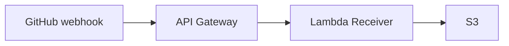

# AWS API Gateway to S3

This Terraform code will deploy an API Gateway to receive GitHub webhooks and forward them to a target API endpoint.  It is designed with the following architecture:

GitHub webhook -> API Gateway -> Lambda Receiver -> S3



This code also configures AWS Athena to query the webhook data in S3.  The query is not perfect for this use case.  It is designed to query logs in S3.  It has some challenges with processing JSON and the data is not denormalized.  However, for simple queries it works great.  In the future it may be worth rewriting the query in Presto or Spark SQL to make it more powerful.  The Athena query is not required.  It is optional.


TODO - Review all the content below... 


## Prerequisites

1. AWS account and configured AWS CLI
2. Terraform installed (version 0.12+)
3. If you don't have one already, create a webhook secret.  Example with openssl below:

   ```bash
   openssl rand -hex 32
   ```  

## Usage

1. Clone this repository
2. Navigate to the project directory
3. Initialize Terraform:

   ```bash
   terraform init
   ```

4. Review and modify the `variables.tf` file if needed
5. Create a `terraform.tfvars` file with your specific values (Include your VPC details for delivery to a private Jenkins host):

   ```bash
   region = "us-east-1"
   github_webhook_secret = "your-github-webhook-secret"
   ```

6. Plan the deployment and apply the changes:

   ```bash
   terraform plan
   terraform apply
   ```

7. Once deployed, create a GitHub webhook at the repository, organization, or enterprise level (Org steps below)
   1. Go to your organization (or repository) and go to settings.
   2. Click on Webhooks
   3. Click "Add webhook"
   4. Set Payload URL to the API Gateway endpoint (output from terraform `api_gateway_url`)
   5. Set Content type to application/json
   6. Set Secret to the GitHub webhook secret (output from terraform `github_webhook_secret_parameter_name`)
   7. Choose which events you want to trigger the webhook (In this case I said Send me everything)
   8. Ensure the "Active" box is checked
   9. Add webhook

Once setup we want to verify.  Assuming you setup the webhook in an active org or enterprise events should just start flowing.  Otherwise you can manually trigger some event in GitHub (like a push) to verify.

## Monitoring or Troubleshooting

You'll want to walk through the following steps to ensure things are working as expected.  

1. Check in GitHub where you created the webhook.  When created it will say it never had a delivery.  Now you should see a success or failure.  
2. API Gateway doesn't show much in it's console.  Go to cloudwatch and see the alarms for the API Gateway or the Lambda that is receiving the webhook.  For example, a 502 on the API Gateway is an error in the Lambda that is receiving the webhook.  This is where you want to start most of the time.
3. Go to the Lambda console, go to your github_webhook_to_s3 function and click the 'Monitor' tab.  See if there are any failures.
4. Click on the 'CloudWatch Logs' link and see if there are any failures in the logs.  Note you can also go directly to this in the CloudWatch console.  The log group is `/aws/lambda/github_webhook_to_s3`.  Generally the logs will show if it is receiving the webhook and if there are any errors in the lambda function.
5. Go to the S3 bucket you created (github_webhook_data).  You can see if the files are being created.  They are named with the delivery id.  Click on one and see if the content looks correct.

## Cost

An estimate of the cost of deploying this configuration in AWS:

| Resource | Cost |
| -------- | -------- |
| API Gateway | $1.00 per million API calls received |
| Lambda | $0.20 per million requests after free tier.  $0.0000166667 for every GB-second compute time used |
| SQS for DLQ | $0.40 per million requests after free tier |
| CloudWatch Logs | $0.50 per GB collected.  $0.03 per GB stored |
| X-Ray | $5.00 per 1 million traces recorded, retrieved, or scanned.  $0.023 per 100,000 traces stored|
| SSM Parameter Store | Standard parameters are free |
| S3 (for Lambda code storage) | $0.023 per GB-month.  $0.005 per 1,000 GET requests |
| S3 (for webhook data) | $0.023 per GB-month.  $0.005 per 1,000 GET requests |

Ultimately the cost will depend on how many webhooks you receive and how long you keep the data in S3.  I'd estimate under $10 per month total.  Maybe $20 at the most.  But this will accrue as you retain the data.

## Other considerations

Note I had considered switching from REST API to HTTP API as it is cheaper.  However, REST API allows policy to create an allow list so I can lock down the API to only allow GitHub's IP range.  HTTP API does not have this feature.  I could use an authorizer lambda or update the receiving lambda to validate the IP, but prefer not to have the potential extra Lambda calls.  The cost of the REST API is minimal.
